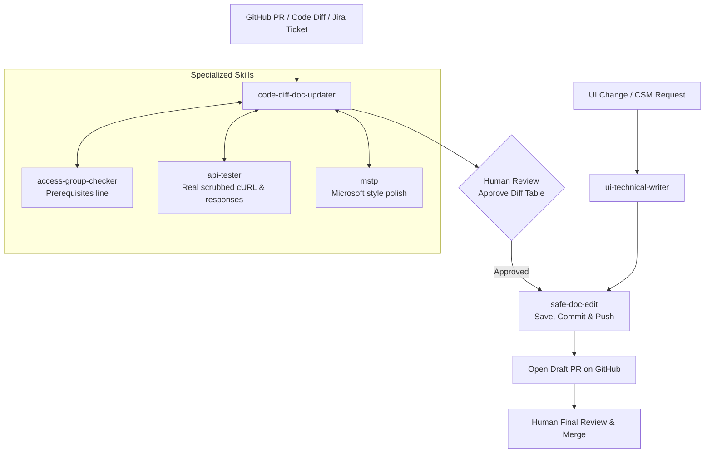

I've been planning to document our documentation process for a while, but lately my enthusiasm for AI things seems to be going down, and as a result, I've postponed this article as well. Even the AI newsletters I've subscribed to go straight to the bin these days, without even getting a glance.

But still, I felt like documenting this would be good.

## What am I writing about here

Basically, the entire documentation process we have now. It's built around our overall development cycle, so it's not something you can blindly copy-paste into a different setup. But definitely, this will help you to get ideas.

### How this benefits you

This should mainly help someone who hasn't yet explored documentation automation in their organization. There's nothing hidden here.

> The easiest way to use this is to feed the whole document to any LLM (Gemini, GPT, whatever you use) along with your own process, and ask it to turn it into a step-by-step guide for setting up something similar for yourself.
{: .prompt-tip }

---

## Things to know before you read this

If you're not into the AI world yet, or your organization is still old-school about this, go through the terms below first:

* **Skill**: A skill is basically a long, structured prompt for the AI. In Claude, these are preset instructions you can call anytime. It's more than plain prompts. A skill can include:
  * Reference material and context the AI should know before acting (style guides, formatting rules, domain knowledge).
  * Step-by-step procedures for handling a specific type of task consistently.
  * Templates or examples that show the expected output format.
  * Scripts or tools that get executed as part of the workflow.
  * Reusable logic, so you don't have to re-explain the same instructions every time you need similar work done.
* **PR**: Mostly a GitHub term. A code change is never updated directly. The developer makes the change and creates a Pull Request, a request to merge those changes. A reviewer reviews it and merges it. Every PR gets a PR number you can use to identify the changes made. In places where documentation files are managed like code, the same process applies.
* **Access group**: The permission level (read or write) a user needs to call a given API. This shows up in our docs as the *Prerequisites* line on each API page — see `access-group-checker` for how that line gets generated.

---

## Our development process in general

We follow a 2-week sprint cycle, so there's a release every 2 weeks. At the end of every release, the development team creates a JIRA ticket listing the released items, each with its JIRA ticket number and the associated GitHub PR number.

The documentation process starts the moment the dev team publishes this release ticket.

To answer the obvious question — no, documentation doesn't go out alongside the development release. In our case, the documentation release happens within 2 weeks of the feature release. I know that's not the ideal process, but right now, this is the realistic approach for us, for a number of reasons.

### Why not auto-trigger on PR merges?

You can also auto-trigger this flow in Claude Code whenever a PR gets merged. We didn't set it up that way. We wanted better control, so we hand-pick which PRs actually need documentation updates and feed those to Claude ourselves. 

We did try a tool called **Promptless** that drafts documentation automatically the moment a code PR merges, and it was genuinely good. We didn't subscribe because of the price. A lot of documentation tools now offer this as a built-in feature. We also tried **readme.io**, but readme being readme, the repo integration never quite worked properly for us.

---

## What we did to achieve this

We built the following skills for Claude Code to run this process:

* `code-diff-doc-updater` (for API docs)
* `safe-doc-edit`
* `api-tester`
* `access-group-checker`
* `mstp`
* `ui-technical-writer` (for UI docs)

Each one is broken down below. For how they hand off work to each other, see [Which skills call who](#which-skills-call-who).

---

### Deep dive into each skill

#### 1. code-diff-doc-updater

This is the main skill for keeping API docs in sync with code changes. You give it a PR or a code change, and it updates the existing docs. Here's what it does, step by step:

1. Grabs the code change — from a PR number, a pasted diff, or a branch.
2. Automatically digs up the related JIRA ticket, its parent project, and any linked pages.
3. Looks at what actually changed and sorts it into categories (new feature, a limit that changed, a field added or removed, an error message changed, etc.), and drops anything that's purely internal and doesn't affect what customers see.
4. Searches the entire docs library for anything mentioning what changed, so nothing gets missed.
5. Also checks whether any other, older version of the same API shares the same underlying code — those need updating too.
6. Checks whether any general "how it works" pages need updating (for example, if a new option was added to a dropdown somewhere).
7. Reads through the affected doc pages carefully and checks them against the standard format — right sections in the right order, correct table columns, whether each field is genuinely required or optional, whether descriptions include limits, defaults, and so on.
8. Writes out all the proposed changes, but doesn't save anything yet.
9. Shows a table of every proposed change and waits for approval before touching anything.
10. **Optional** — can be asked to use the `api-tester` skill to test the API and add tested sample curls and responses to the documentation.
11. Once approved, hands off to the `safe-doc-edit` skill to actually save and publish it.
12. Finally, creates a tracking ticket in JIRA and adds an entry to the release notes.

#### 2. safe-doc-edit

This is the only skill allowed to actually save files, commit, and open pull requests.

1. Checks nothing is already in a messy state before starting.
2. Makes only the edits it was told to make, nothing extra.
3. Saves the changed files and writes a commit message.
4. Pushes the changes and opens a pull request marked as "draft" (not final), always targeting the right base version.
5. Waits for comments on GitHub.
6. If comments come in, goes back, fixes each one, and marks each comment as resolved.
7. Keeps the pull request up to date if other changes land in the meantime.
8. **Safety guarantee**: You are always the one who does the final merge — it never merges on its own.

#### 3. api-tester

This fires real test calls against the API to get genuine examples for documentation, instead of guessing from a spec.

1. Asks for an authentication token (make sure to share a test-org token with restricted lifetime).
2. Does a quick test call first, to confirm the login actually works.
3. Figures out which API calls need to be tested.
4. Runs a standard set of tests for each one — does it work correctly, what happens if you leave out a required field, what happens with wrong login info, what happens if you ask for something that doesn't exist, and a few more edge cases.
5. Before showing any results, scrubs out all real customer data, tokens, and IDs, and replaces them with generic placeholders.
6. Packages up the request and response as a ready-to-paste example.
7. Updates the API spec file with these real (but scrubbed) examples.
8. Offers to hand the examples off to whichever skill is writing the actual doc page.

#### 4. access-group-checker

This figures out which permission (an "access group") is needed to use a given API, and writes the one-line note that goes in a doc's *Prerequisites* section.

1. Looks at the API's endpoint and which action it performs (read or write).
2. Looks it up in a permissions list that Capillary's live system also reads from.
3. If it's not found there, asks the live permissions system directly.
4. Works out whether it needs read or write access based on whether it's a GET (view) or a POST/PUT/DELETE (change) call.
5. If it truly isn't listed anywhere, says so plainly rather than guessing.
6. Produces the final one-line note for the doc. It works in two modes: writing the line fresh for a brand-new page, or checking an existing page's line and flagging it if it's missing or wrong.

#### 5. mstp

A writing-style checker, based on Microsoft's style guide. It checks things like: is the tone friendly and simple, is it in plain everyday words rather than jargon, is it written in an active, direct way, are headings and lists formatted consistently, are technical terms defined, and so on. 

When another skill calls it, it fixes the writing quietly in the background — you just see the cleaned-up version, not a separate list of complaints.

#### 6. ui-technical-writer

This is for writing user guides aimed at Customer Success Managers (CSMs) — not developer-facing API docs. It first figures out what kind of request it's dealing with, then writes it, then publishes it.

---

## Which skills call who

Through the entire process, these skills call each other and hand off work according to a set pattern:

* The main pipeline (`code-diff-doc-updater`) calls the permissions checker (`access-group-checker`) to fill in or check the Prerequisites line, whether it's updating an old page or writing a new one.
* When writing a brand-new page, it also calls the API tester (`api-tester`) to get real working examples, and the writing-style checker (`mstp`) to polish the wording — both run at the same time as the writing itself.
* Once everything is ready and approved, the main pipeline calls `safe-doc-edit` to actually save, commit, and publish.
* The API tester, after it finishes testing, also calls `safe-doc-edit` itself to save its updated example files, and can hand its results over to the main pipeline or the `ui-technical-writer` skill if asked.
* `safe-doc-edit` is the last stop — it doesn't call anything else; everyone else calls it.

---

## How you can use these to set up the process

### Setting Up Claude for Documentation Work

#### 1. Create Skills
Go through the available skills and shortlist the ones you'd actually need. For any steps in your process that fall outside these, figure out which skill they'd fit under — or whether you need a new one.

Use Claude itself to create these skills: describe your workflow step by step, in the order you follow it, and ask Claude to turn it into a skill. Do this separately for each skill, then save them to your skill set.

#### 2. Save Skills to Your Doc Repo
Save these skills to your documentation repo rather than as standalone Claude skills — the repo is easier for you to modify and manage over time.

#### 3. Get Repo Access Sorted
Make sure you have access to all the relevant code repos, and provide your GitHub authentication credentials to Claude Code so it can access the code.

> Make sure to get the necessary approvals from your IT security team before connecting automated AI tools to code repos.
{: .prompt-warning }

#### 4. Connect Confluence and JIRA
Enable the Confluence/JIRA connector and provide access, so Claude Code can look up tickets, linked pages, and background docs on its own — instead of you fetching them manually.

#### 5. Run It on a Real PR
Once your skills are set up, give Claude Code a real GitHub PR for a documentation update and ask it to use the specific skill to start the documentation process.

#### 6. Stay in the Loop
Keep an eye on the questions Claude asks along the way, and respond appropriately.

#### 7. Consider Bypass Permission Mode
You can set Claude to bypass permission mode to avoid getting hit with multiple approval requests along the way.

#### 8. Ask for a Recap
Towards the end, if you feel Claude skipped a step, ask it to list out the steps it followed — that way you can confirm nothing was missed.

---

As I mentioned before, you can enhance this process and set it up so that this workflow auto-triggers whenever a PR is merged. We did not try or set up this, as the number of PR merges is high and it would be difficult for us to track.
